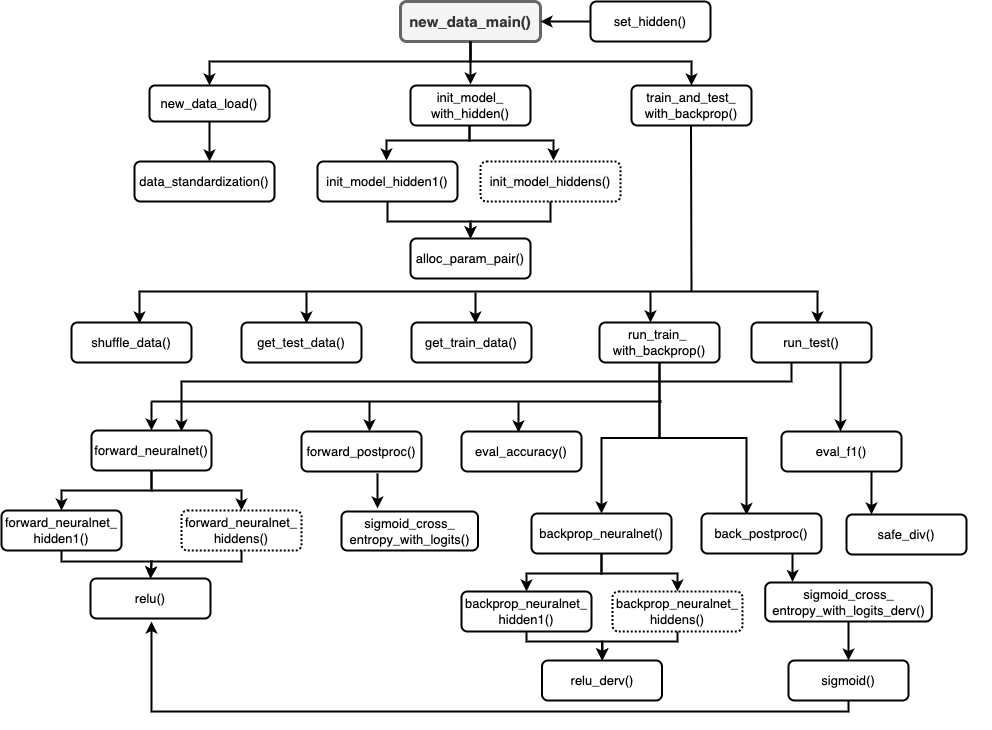

# DS/AI 부트캠프 - 개인 프로젝트 개요
(최신순)

## [다섯 번째 프로젝트]: 이진 분류 인공신경망 프로그래밍 (from Scratch)
- 작성: 2023년 1월 13일   
- 코드 파일: [my_proejct5_code.ipynb](https://github.com/kongju7/my_project5/blob/main/my_project5_code.ipynb)

### 프로젝트 개요

1. 지정 과제 
    - 이진 분류 인공신경망 프로그래밍 (from Scratch)
    - 요구 사항 
      - 모델 파이프라인 시각화 
      - 인공신경망의 순전파 연산 방식 구현 
      - 성능 측정(손실 함수, 정확도) 구현
      - 데이터 정제(분리), 미니배치 구현 
    - **제한 조건** (중요) 
      - **Numpy, Pandas, Csv, Matplotlib, Python 내장 함수로만 구현** 
    - 과제용 지정 데이터 
      - 기술 통계값 확인: 데이터의 분포 상이, 이상치 확인  
      - 불균형 데이터: 기준 모델(baseline model) 정확도 70% 

2. 모델 개선 1단계: 역전파 추가 
    - 역전파 추가  
      - 가중치와 편향 손실 기울기와 학습률을 활용하여 학습 수행 
    - 데이터 처리 
      - 불균형 데이터 처리: 데이터 복제 방법 활용 → 균형 데이터로 수정 옵션 추가 
      - 데이터 표준화(standardization) 처리: 반복문을 통해 평균 및 표준편차 활용해 구현 
    - 평가 지표 추가 
      - 정밀도(precision), 재현율(recall), F1 값 추가
      - 혼동 행렬(confusion matrix) 작성 
    - 과제용 데이터에 (모델 개선 1단계) 역전파 추가 모델 적용 

3. 모델 개선 2단계: 은닉층 추가 
    - 은닉층 구조 지정 및 그에 따른 가중치 초기화, 역전파, 순전파 각각 구현 
    - 과제용 데이터에 (모델 개선 2단계) 은닉층 추가 모델 적용 
    - 새로운 데이터에 은닉층 추가 모델 적용 → 성능 확인
       - 데이터: Web page Phishing Detection Dataset (이진 분류)
       - 출처: www.kaggle.com/datasets/shashwatwork/web-page-phishing-detection-dataset

  
  
4. 평가 및 향후 계획 
    - 데이터 탐색 수행 → 데이터 특성 파악 및 관련 함수 작성
    - 클론 코딩 형태로 구현 → 수정∙보완 
      - <파이썬 날코딩으로 알고 짜는 딥러닝>(윤덕호, 2019)의 코드를 기반으로 수정∙보완하여 완성함 
    - 함수 문서 및 상세한 설명 작성 
    - 지정 데이터 외 새로운 데이터 적용하여 최종 모델 성능 평가      
    - 향후 계획 
      - 모델 고도화: 클래스 형태로 구현 등 
      - 회귀 분석, 다중 분류 등 다른 인공신경망 프로그래밍  

